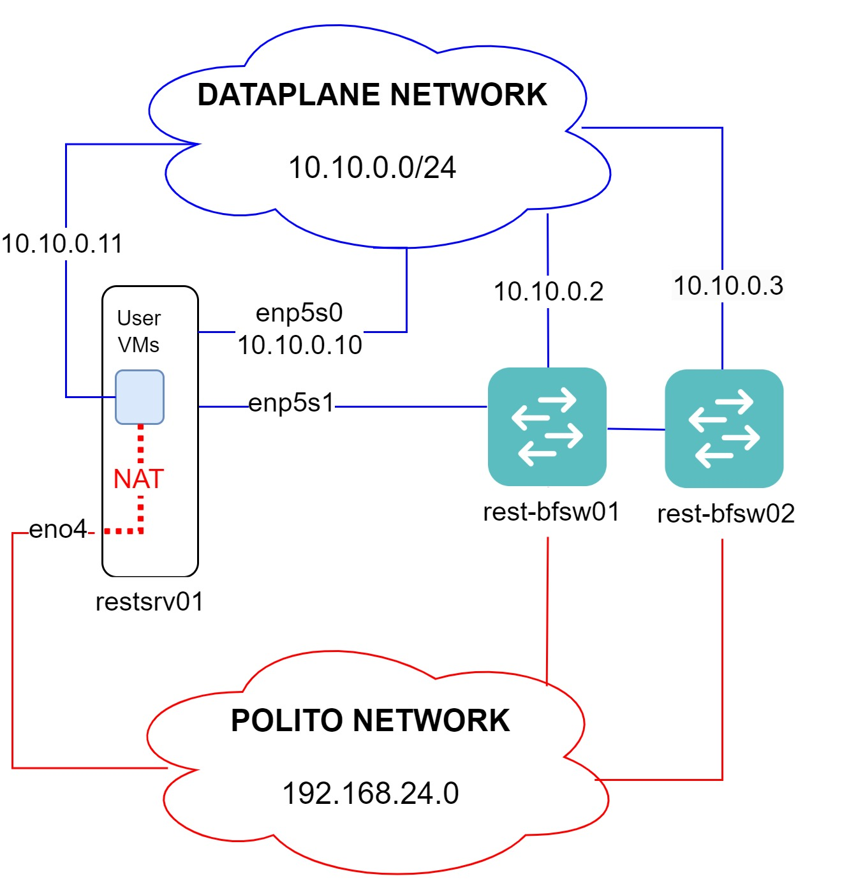

# SUPERNET: the SUPER programmable P4 NETwork cluster

Set of Ansible automation script to deploy new Virtual Machines (VMs) within the experimental SUPER testbed within Politecnico di Torino. Each VM is configured with:

* Intel P4 Studio and Tofino switch model
* Network access to the dataplane network `10.10.0.0/24`

## Overview (subject to changes)
The cluster might be subject to changes as new/current servers are integrated/replaced. In its current configuration contains one server `restsrv01.polito.it` equipped with Debian 12, which hosts tenants VMs (KVM libvirt + QEMU).

Two Intel Tofino P4 programmable switches `rest-bfsw01.polito.it` and `rest-bfsw02.polito.it`  are available.

<div align="center">

</div>


The repository contains a set of playbooks to manage VMs for new users on the `restsrv01` node. 

Access to the VM is granted via `ssh` following [User's VM access guide](#user-access-to-vm).

### Network
Each VM will be assigned a virtual network interface directly attached to the dataplane network (bridged mode). This interface is intended for experiments with the Tofino devices. 

Internet connectivity to the VMs is provided through a second interface (NAT mode), and must be exclusively used for control operations e.g., install packages. Traffic generated on this interface is NOT routed through Tofino switches.

See [details here](./roles/kvm_provision/README.md).

### P4 development environment and utilities
VMs are provisioned with Intel P4 Software Development Environment (version 9.13.2) installed under `/opt/p4-sde/bf-sde-9.13.2`. The following commands are available:

* `p4-build`: convenience script to build P4 programs
* `sde`: change directory to SDE directory
* `p4`: alias for `/opt/p4-sde/bf-sde-9.13.2/run_switchd.sh` 
* `iftofinoup`/`iftofinodown`: creates/destroys veth pairs to work with the Tofino Model
* `tfm`: alias for `/opt/p4-sde/bf-sde-9.13.2/run_tofino_model.sh`
* `switch-intel`: runs Intel Switch.p4, i.e., alias for `/opt/p4-sde/bf-sde-9.13.2/run_switchd.sh -p switch`

## VM installation with Ansible playbooks
Admin users can create a new VM with two steps:

* Pick an available IP address in the dataplane network.
* Run the Ansible roles following the [instructions](playbooks/README.md).

List of IP addresses in use (temporary and to be replaced with DHCP):

| IP address | Hostname | Description | Contact |
| --- | --- | --- | --- |
| `10.10.0.2` | `rest-bfsw01` | Tofino internal CPU Ethernet port | admin
| `10.10.0.3` | `rest-bfsw01` | Tofino internal CPU Ethernet port | admin
| `10.10.0.10` | `restsrv01` | Dataplane port `enp5s0` | admin
| `10.10.0.11` | `restsrv01-smartdata01` | User VM | zhihao.wang@polito.it


## User access to VM

Enabled users can connect to their VMs through `ssh`, from within PoliTO local network. For external users, VPN must be acrivated first. 

To access PoliTO VPN and creation of user account ask:
* alessandro.cornacchia@polito.it
* paolo.giaccone@polito.it

### Connect to VMs through SSH
VMs are not directly visible on the PoliTO network, but are reachable by using `restsrv01` as a bastion proxy.
You have two options to connect. 

1) Connect via ssh to `restsrv01.polito.it`, and from there connect via ssh to your VM:

```
ssh ubuntu@restsrv01.polito.it
ssh <your user>@<vm hostname>
```

2) Single-step `ssh` using `restsrv01.polito.it` as a jump proxy:

```
ssh -J ubuntu@restsrv01.polito.it <your user>@<vm hostname>
```

For convenience, you may want to add the following lines to your `.ssh/config` file. Replace:

* `<vm hostname>` with your VM's hostname (e.g., `restsrv01-smartdata01`).
* `<VM user>` and `<proxy user>` with your username on the VM and on `restsrv01` (proxy server) respectively. Likely they are the same.

```
Host <vm hostname>
  User <VM user>
  ProxyCommand ssh <proxy user>@restsrv01.polito.it -W %h:%p
```

You can then connect by only typing on your client:
```
ssh <vm hostname>
```

### Note about hostname resolution
The name `<vm hostname>` is only resolved locally at `restsrv01.polito.it` (thanks to `libvirt-nss` VM name resolution plugin). It cannot be resolved from other hosts outside `restsrv01.polito.it`, as no DNS records for the VMs exist.